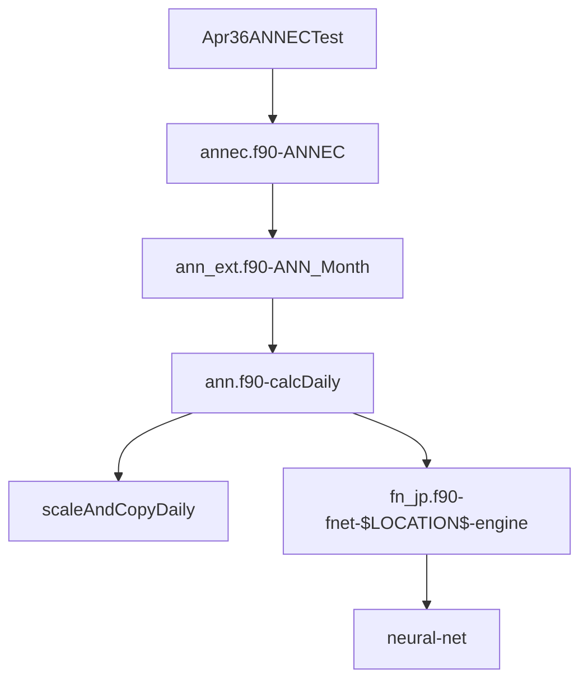
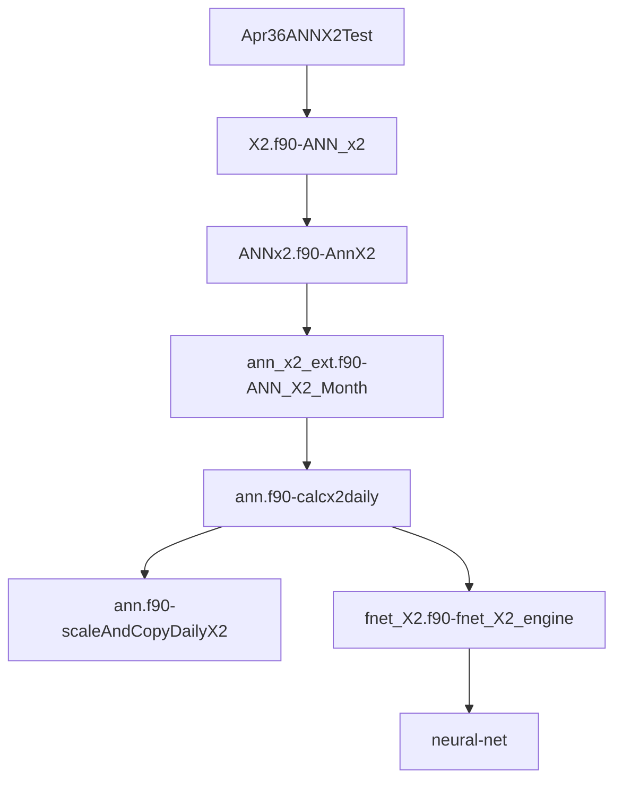

## EC

### Call sequence diagram

Note:  $LOCATION$ is a placeholder for one of: jp, orrsel, emm, antioch, CO, mallard, LosVaqueros, MidR_intake, Victoria_intake, CVP_intake, CCFB, CCFB_intake, beldan, MTZ

### Call sequence table

| File                                                                                                        | Method              | Calls Into                                                                                                                            | Notes                                                                                                                                         |
| ----------------------------------------------------------------------------------------------------------- | ------------------- | ------------------------------------------------------------------------------------------------------------------------------------- |-----------------------------------------------------------------------------------------------------------------------------------------------|
| [Apr36ANNECTest.f90](https://github.com/rma-rripken/AnnLineGen_RMA/blob/master/src/test/Apr36ANNECTest.f90) | Apr36AnnLineGenTest | [ANNEC](https://github.com/rma-rripken/AnnLineGen_RMA/blob/bd132e2aaf480c033c706d615bb942fc3f30bab4/src/test/Apr36ANNECTest.f90#L112) |                                                                                                                                               |
| [annec.f90](https://github.com/rma-rripken/AnnLineGen_RMA/blob/master/src/annec.f90)                        | ANNEC               | [ANN_Month](https://github.com/rma-rripken/AnnLineGen_RMA/blob/bd132e2aaf480c033c706d615bb942fc3f30bab4/src/ann_ext.f90#L48)          | data manipulation: adds sac to sac_oth, and adds Qexp and Qexp_oth, - builds arrays from inputs and fills in values.  ave_type is passed thru |
| [ann_ext.f90](https://github.com/rma-rripken/AnnLineGen_RMA/blob/master/src/ann_ext.f90)                    | ANN_Month           | [calcdaily](https://github.com/rma-rripken/AnnLineGen_RMA/blob/bd132e2aaf480c033c706d615bb942fc3f30bab4/src/ann.f90#L106)             | handles ave_type by calling calcdaily over various ranges and calculates a sum with min/max/ave depending on ave_type                         |
| [ann.f90](https://github.com/rma-rripken/AnnLineGen_RMA/blob/master/src/ann.f90)                            | calcdaily           | [scaleAndCopyDaily](https://github.com/rma-rripken/AnnLineGen_RMA/blob/bd132e2aaf480c033c706d615bb942fc3f30bab4/src/ann.f90#L165)     | scales the input and then calls appropriate ann based on location and then scales the output.                                                 |
| [ann.f90](https://github.com/rma-rripken/AnnLineGen_RMA/blob/master/src/ann.f90)                            | calcdaily           | [fnet_jp_engine](https://github.com/rma-rripken/AnnLineGen_RMA/blob/bd132e2aaf480c033c706d615bb942fc3f30bab4/src/ann.f90#L188)        |                                                                                                                                               |

Note: ANN_Month called with ave_type=1 which == monthly_ave

## X2

### Call sequence diagram:

### Call sequence table

| File                                                                                                        | Method         | Calls Into                                                                                                                            | Notes                                                            |
| ----------------------------------------------------------------------------------------------------------- | -------------- | ------------------------------------------------------------------------------------------------------------------------------------- |------------------------------------------------------------------|
| [Apr36ANNX2Test.f90](https://github.com/rma-rripken/AnnLineGen_RMA/blob/master/src/test/Apr36ANNX2Test.f90) | Apr36ANNX2Test | [ANN_x2](https://github.com/rma-rripken/AnnLineGen_RMA/blob/cf830330f4f717e487af41aa2be7954305335a74/src/test/Apr36ANNX2Test.f90#L68) |                                                                  |
| [X2.f90](https://github.com/rma-rripken/AnnLineGen_RMA/blob/master/src/X2.f90)                              | ANN_x2         | [AnnX2](https://github.com/rma-rripken/AnnLineGen_RMA/blob/cf830330f4f717e487af41aa2be7954305335a74/src/X2.f90#L24)                   | Calls ANNX2 with hardcoded location 13                           |
| [AnnX2.f90](https://github.com/rma-rripken/AnnLineGen_RMA/blob/master/src/annx2.f90)                        | AnnX2          | [ANN_X2_Month](https://github.com/rma-rripken/AnnLineGen_RMA/blob/cf830330f4f717e487af41aa2be7954305335a74/src/annx2.f90#L128)        | Builds arrays, retrieves tide data,                              |
| [ann_x2_ext.f90](https://github.com/rma-rripken/AnnLineGen_RMA/blob/master/src/ann_x2_ext.f90)              | ANN_X2_Month   | [calcx2daily](https://github.com/rma-rripken/AnnLineGen_RMA/blob/cf830330f4f717e487af41aa2be7954305335a74/src/ann_x2_ext.f90#L55)     | Handles the ave-type.  Calls calcx2daily with appropriate ranges |
| [ann.f90](https://github.com/rma-rripken/AnnLineGen_RMA/blob/master/src/ann.f90)                            | calcx2daily    | [scaleAndCopyDailyX2](https://github.com/rma-rripken/AnnLineGen_RMA/blob/cf830330f4f717e487af41aa2be7954305335a74/src/ann.f90#L165)   | scales input, calls ann, scales ann_output                       |
| [ann.f90](https://github.com/rma-rripken/AnnLineGen_RMA/blob/master/src/ann.f90)                            | calcx2daily    | [fnet_X2_engine](https://github.com/rma-rripken/AnnLineGen_RMA/blob/cf830330f4f717e487af41aa2be7954305335a74/src/ann.f90#L188)        |                                                                  |

