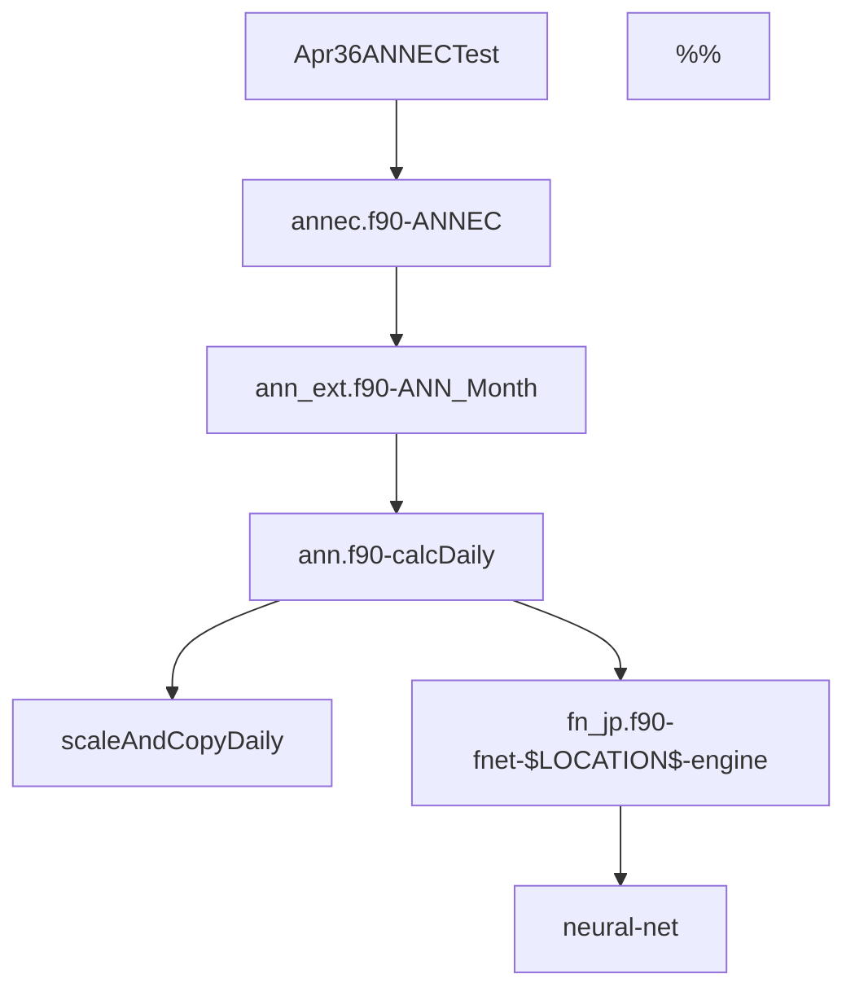
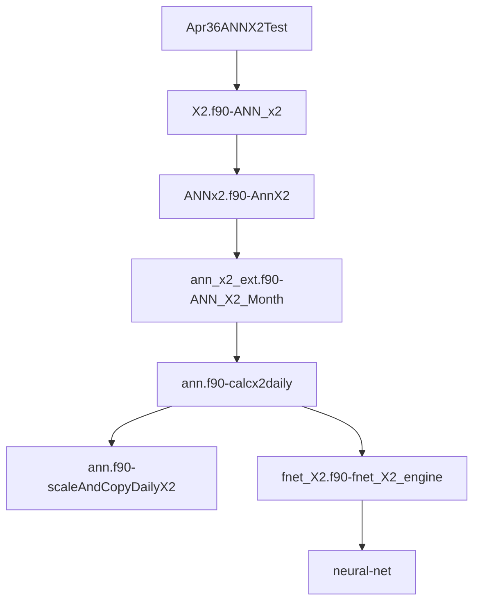

The Apr36ANNECTest call sequence:

ANN_Month called with ave_type =1 which is monthly_ave
ANNEC:  https://github.com/rma-rripken/AnnLineGen_RMA/blob/a0861788fe050fa4b421a0e3625c936d66e9dd9a/src/annec.f90#L38

The Apr36ANNx2Test call sequence:

Note:
ANN_x2 calls ANNX2 with same parameters but hard-coded "location" 13

